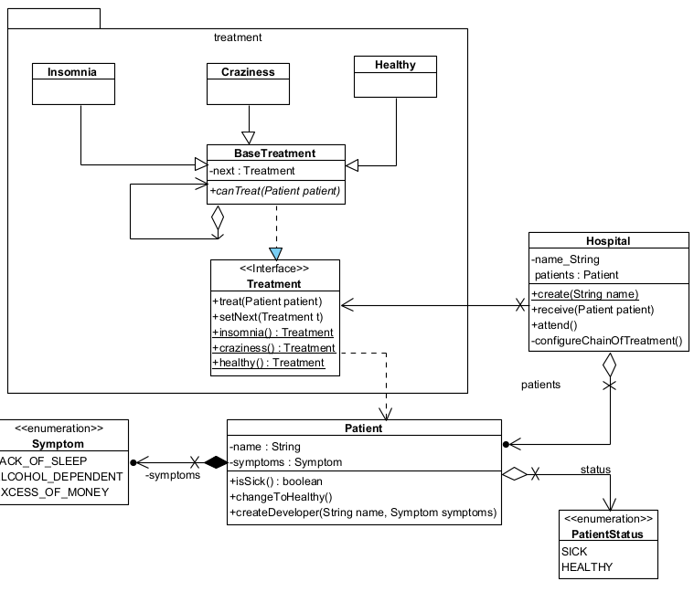

## The crazy hospital
In our hospital we only attend developers, they come to us with certain symptoms:
Symptoms: Lack of sleep, Alcohol-dependent, Excess of Money

We have 3 possible categories a given Patient could be treated for depending on the symptoms

1. Insomnia
2. Craziness
3. Healthy

### Solution
I used the Chain of responsibility principle to solve the problem. A Patient go to the hospital with certain
symptoms, but, the hospital is not pretty clear about what symptoms the Patient has. So, it needs to 
evaluate the symptoms and validate if there is any treatment. 

